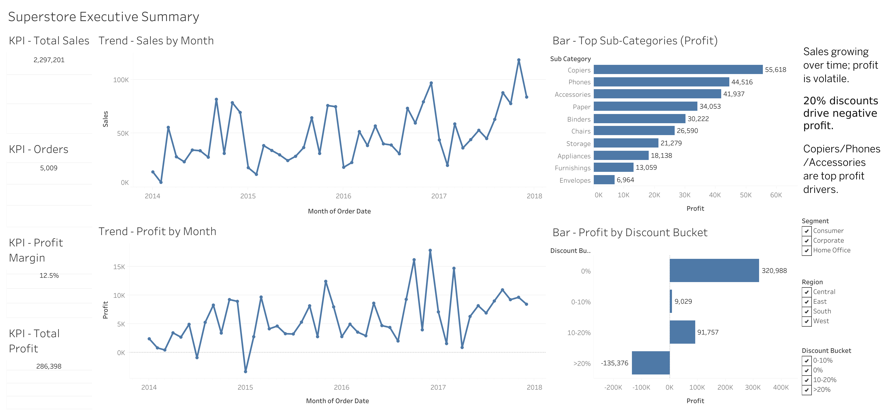

# Superstore Analytics (SQL + pandas + Tableau)

Portfolio data analytics project based on the *Sample Superstore* dataset.
Goal: demonstrate SQL querying, dimensional modeling (star schema), pandas analysis, and BI dashboarding.

## Live Dashboard
Tableau Public: https://public.tableau.com/views/SuperstoreExecutiveSummary_17703760537380/SuperstoreExecutiveSummary?:language=en-GB&publish=yes&:sid=&:redirect=auth&:display_count=n&:origin=viz_share_link



## Key Takeaways
- Sales trend increases over time, while profit is volatile month-to-month.
- Discounts above 20% are strongly associated with negative total profit.
- Top profit-driving sub-categories include Copiers, Phones, and Accessories (varies by filters).

## Dataset
- Source: Sample - Superstore (CSV)
- Grain: one row per order line (`row_id`)
- Period: 2014–2017 (based on `order_date`)

## Project Workflow
1. Load raw CSV into PostgreSQL (`raw_superstore`).
2. Run basic exploration queries (sanity checks + aggregates).
3. Build a star schema:
   - `fact_sales` + dimensions (`dim_customer`, `dim_product`, `dim_geo`).
4. Create an analysis-ready mart (`superstore_mart.csv`) for Tableau.
5. Build Tableau dashboard and publish to Tableau Public.

## Repo Structure
- `sql/` — DDL + loading + analysis queries
- `notebooks/` — pandas analysis / feature engineering
- `data/processed/` — final dataset used in Tableau (`superstore_mart.csv`)
- `dashboards/` — Tableau workbook + screenshots

## How to Reproduce

### 1) Database setup (PostgreSQL)
Create database (example):

```sql
create database superstore_db;
```

Run scripts in order:
- `sql/01_schema_raw.sql`
- `sql/02_load_raw.sql`
- `sql/03_basic_analysis.sql`
- `sql/04_star_schema.sql`

### 2) Python environment
Create and activate venv, then install dependencies:

```bash
python -m venv .venv
source .venv/bin/activate
pip install -r requirements.txt
```

Run notebook:
- `notebooks/01_eda_superstore.ipynb`

It generates:
- `data/processed/superstore_mart.csv`

### 3) Tableau
Connect Tableau Public/Desktop to:
- `data/processed/superstore_mart.csv`

(Optional) Workbook file:
- `dashboards/tableau/superstore_executive_summary.twb` (or `.twbx`)

## Tech Stack
- PostgreSQL (SQL, star schema)
- Python (pandas, Jupyter)
- Tableau Public (dashboard)

## Notes
- Tableau Public dashboards are public by design.
- The dataset contains no sensitive data.